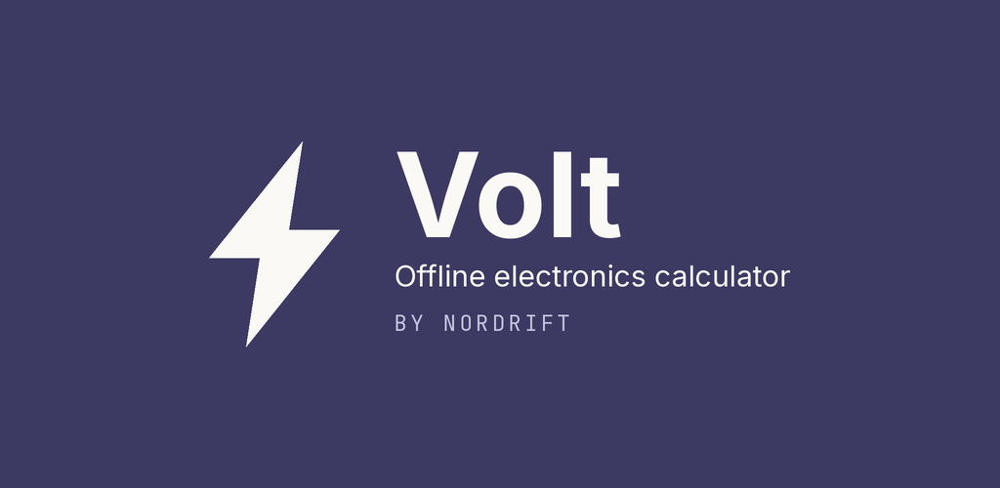
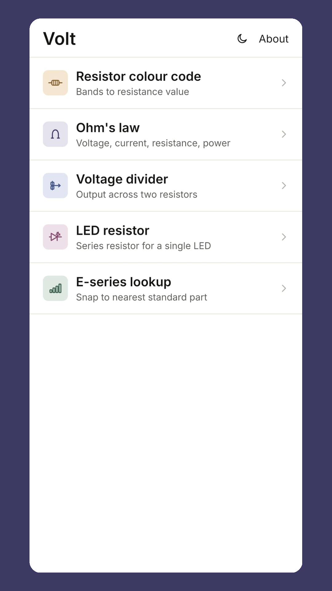
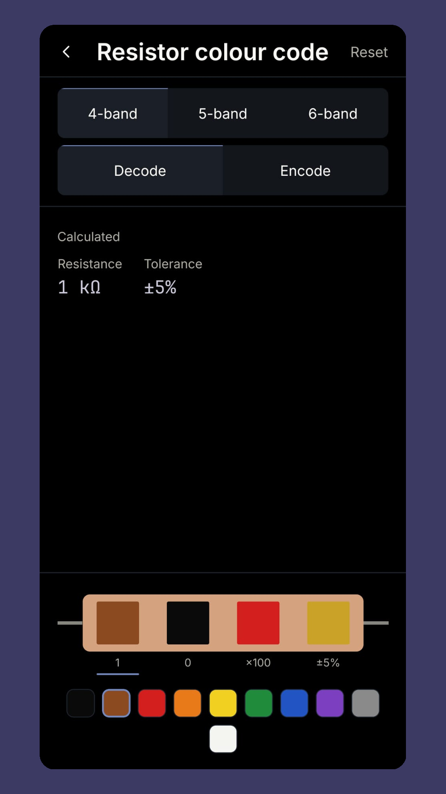
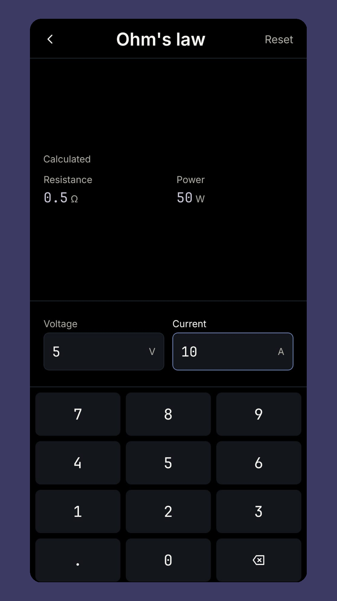
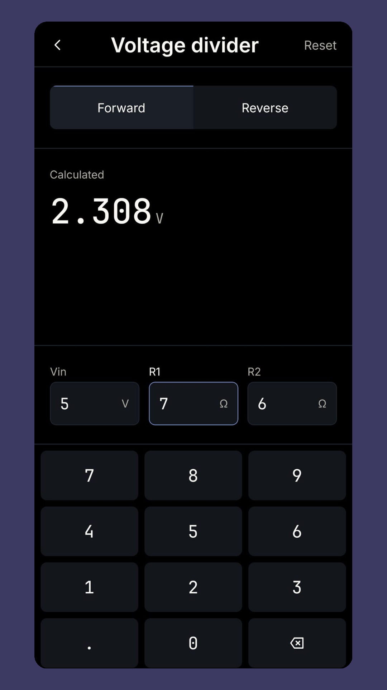
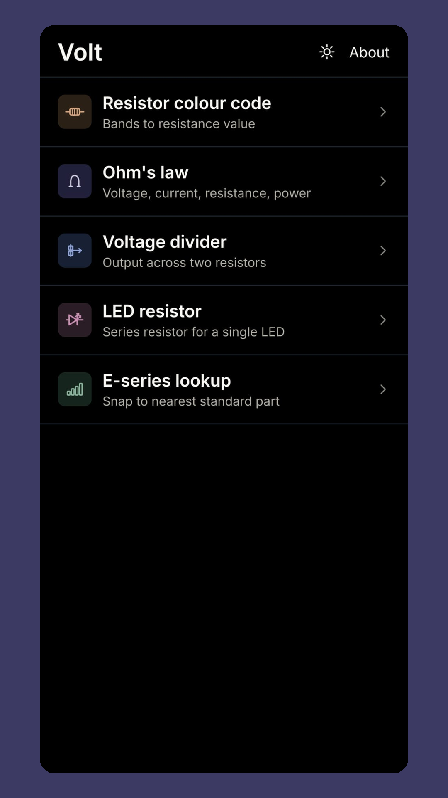
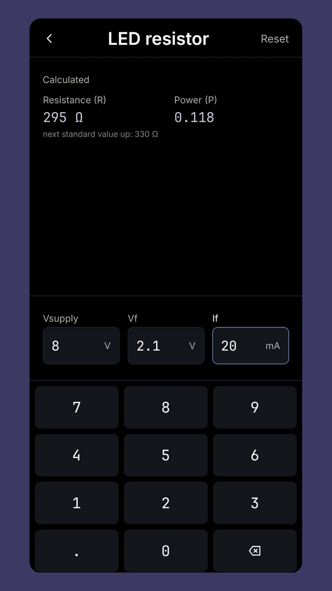
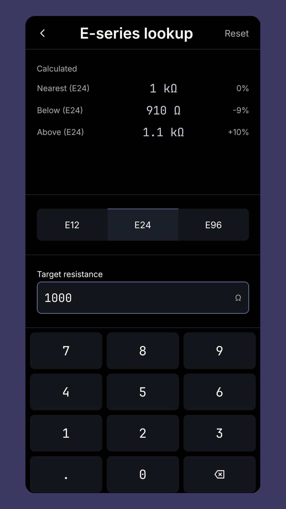

<p align="center">
  
</p>

<p align="center">
  An offline calculator for electronics bench work.<br>
  Opens instantly, works without a connection, and asks for no permissions.
</p>

<p align="center">
  
  
  
  
  
</p>

<p align="center"><strong>Google Play:</strong> in review. Link coming soon.</p>

---

<table>
  <tr>
    <td></td>
    <td></td>
    <td></td>
    <td></td>
  </tr>
  <tr>
    <td></td>
    <td></td>
    <td></td>
    <td></td>
  </tr>
</table>

## Why

Most resistor calculators on the Play Store are slow, full of ads, and ask for a network connection they never use. Volt does five things a person at a breadboard actually needs, and gets out of the way.

## Tools

| Tool | What it does |
| :--- | :--- |
| **Resistor colour code** | Decode 4, 5 and 6-band resistors to a value, or encode a value back to bands. Tolerance and temperature coefficient included. |
| **Ohm's law** | Enter any two of voltage, current, resistance and power; the other two are calculated live. |
| **Voltage divider** | Forward: R1, R2 and Vin to Vout. Reverse: Vin and a target Vout to ranked standard-value R1/R2 pairs across E12, E24 and E96. |
| **LED series resistor** | Supply voltage, forward voltage and current to the required resistor, its power dissipation, the next standard value up, and a warning above ¼ W. |
| **E-series lookup** | Any resistance to the nearest standard part in E12, E24 or E96, with the values either side and the percentage error. |

The tools chain: size a divider, get 3.47 kΩ, and the next step is finding the nearest E24 part.

## Design decisions

- **Offline and permission-free.** No network access, no analytics, no crash reporting. `INTERNET` and the other permissions Expo adds by default are explicitly blocked in `app.json`. The only thing stored on the device is the light/dark theme choice.
- **Calculated values are separated by position, not just colour.** Every tool screen has the same four zones: header, Calculated, Entered, keypad. Nothing you typed ever appears in the Calculated zone, so the layout still reads correctly in greyscale.
- **A fixed, in-app keypad.** The system keyboard is replaced by a 12-key pad that never slides in or out, so the layout never shifts and every key is thumb-sized regardless of the phone's keyboard.
- **Live results.** There is no Calculate button. Empty values show an em dash, never a fake zero.
- **Two themes on one token set.** Light by default, dark on request. Every colour, size and spacing value comes from [`src/theme.ts`](src/theme.ts), derived from [`docs/DESIGN.md`](docs/DESIGN.md).

## Architecture

```
src/
  app/          screens, one file per route (Expo Router, stack navigation)
  components/   shared UI: header, zones, input wells, keypad, pickers, icons
  lib/          calculations as pure functions, plus their tests
  theme.ts      design tokens and the theme store
plugins/        Expo config plugins for the Android 12+ splash and R8 minification
docs/           product spec, design spec and technical report
store/          Google Play listing assets
```

Every calculation lives in `src/lib` as a pure, exported function with no React dependency. Screens only collect input and render results. This keeps the maths testable in isolation and the screens thin.

```ts
import { calculateLedSeriesResistor } from "@/lib/led-resistor";

calculateLedSeriesResistor(5, 2, 0.02);
// { resistanceOhms: 150, powerWatts: 0.06, nextStandardValueOhms: 150, exceedsQuarterWatt: false }
```

## Tech stack

React Native 0.86 · Expo SDK 57 · Expo Router · TypeScript (strict) · react-native-svg · AsyncStorage · Jest

No UI library, no state library. Theme is a small module-level store read through `useSyncExternalStore`; everything else is local component state.

## Getting started

```bash
npm install
npm start            # Metro bundler
npm run android      # build and open on a connected device or emulator
npm test             # unit tests for src/lib
npm run lint
```

Release builds use [EAS Build](https://docs.expo.dev/build/introduction/) with the profiles in `eas.json`.

## Documentation

- [Technical report](docs/REPORT.md): problem, design, implementation, testing and results
- [Product specification](docs/PRODUCT.md): scope, tools, data model and what is deliberately left out
- [Design specification](docs/DESIGN.md): tokens, type, spacing, components and interaction rules

## Roadmap

Planned for v2, in order: pinout reference (ESP32, Arduino, Raspberry Pi GPIO), SMD resistor and capacitor codes, series/parallel combinations, RC filter cutoff, battery life estimator, PCB trace width.

## License

[MIT](LICENSE). Volt is built and published by [Nordrift](https://nordrift.dev).
